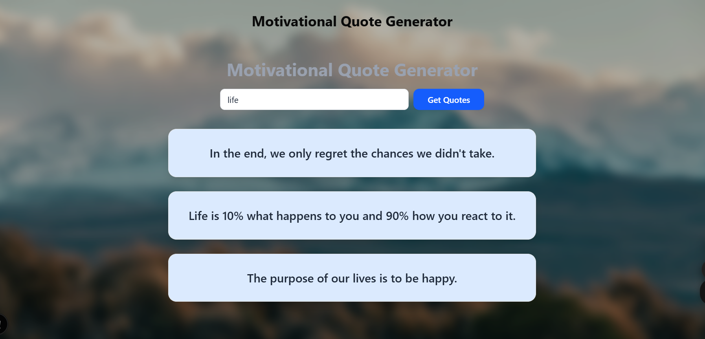
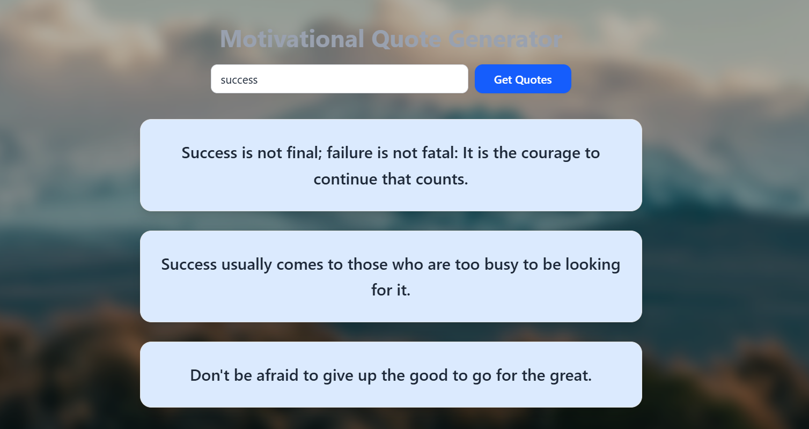
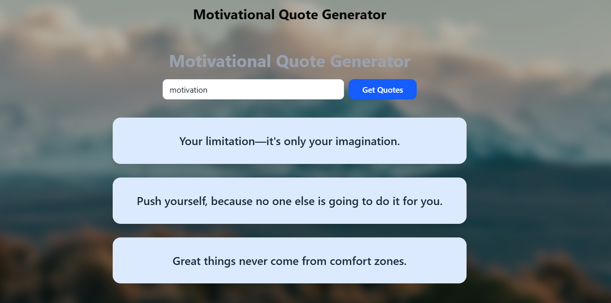

# Nexium_Fatima_Motivational_Quote_Generator
# Motivational Quote Generator ✨

A clean and interactive **Next.js** web app that generates motivational quotes based on topics like **success**, **motivation**, and **life**. Built with Tailwind CSS for a modern, responsive interface.

> 🟢 Live Site:  
> 👉 [https://nexium-fatima-motivational-quote-generator-k30csp7cq.vercel.app/](https://nexium-fatima-motivational-qu-git-e9475e-fatimarana50s-projects.vercel.app)

---

## 🚀 Features

- 🔍 Topic-based quote generation (e.g., success, motivation, life)
- 🎨 Light & dark mode support
- 🖼️ Background image with error fallback
- 🧠 Static quotes dataset
- 📱 Fully responsive design using Tailwind CSS

---

## 🧰 Tech Stack

- [Next.js](https://nextjs.org/)
- [React](https://reactjs.org/)
- [Tailwind CSS](https://tailwindcss.com/)
- TypeScript

---

## 🖼️ Screenshots

| Input Form | Quote Display | Dark Mode |
|------------|----------------|-----------|
|  |  |  |

---

## 🛠️ Running Locally

1. Clone the repo:
   ```bash
   git clone https://github.com/FatimaRana50/Nexium_Fatima_Motivational_Quote_Generator.git
   cd Nexium_Fatima_Motivational_Quote_Generator/assignment-1
Install dependencies:

bash
Copy
Edit
npm install

Start the dev server:

bash
Copy
Edit
npm run dev
Visit:
http://localhost:3000

##📁 Project Structure
assignment-1/
├── app/
│   ├── layout.tsx
│   ├── page.tsx
│   └── QuoteForm.tsx
├── public/
│   └── images/
│       ├── Capture2.PNG
│       ├── Capture3.PNG
│       └── Capture4.PNG
├── styles/
│   └── globals.css
├── package.json
├── tsconfig.json
└── README.md
⭐ If you found this project useful or cool, give it a star on GitHub!
